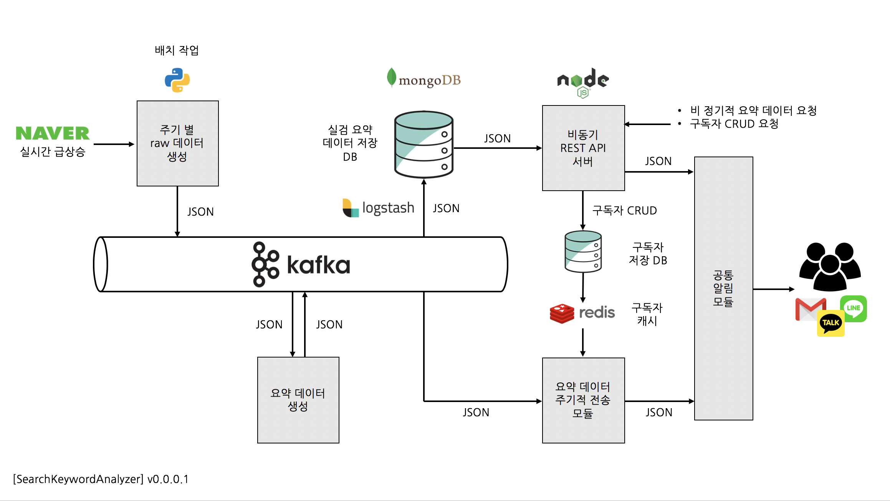

# SearchKeywordAnalyzer

## 요약
네이버 실시간 급상승 검색어를 대상으로, 왜 실검에 올랐는지 요약하여 알려주는 프로젝트


## 구조


* 각 모듈들이 개별적으로 동작하며, 특정 모듈의 장애가 타 모듈들에게까지 영향을 주지 않도록 하는 것을 기본으로 합니다.
* 다이어그램에 표시된 기술들은 임의로 선정한 기술들로 언제든지 대체될 수 있으며, 사용 가능한 모든 기술들을 적용할 수 있습니다.


## 세부 설명

### Backend

1. **RawDataCrawler** ([Link](https://github.com/SearchKeywordAnalyzer/RawDataCrawler))
   1. 주기별(예: 1분마다)로 **네이버 실시간 급상승 키워드와, 각 키워드 별 네이버 검색 결과를 크롤링**
   2. 크롤링 결과를 JSON 포맷으로 kafka에 전달

2. **KeywordSummarizer**
   1. Kafka에 저장된 JSON 형태의 Raw data를 가져와 **각 키워드별로 왜 실검에 올랐는지 요약 데이터를 생성**

1. ```json
   { "keyword": "트와이스", "summary": "트와이스는 9일 오후 6시 두 번째 스페셜 앨범 ‘서머 나이트(Summer Night)’의 타이틀곡 ‘댄스 더 나이트 어웨이(Dance The Night Away)’를 공개했다." }
   ```

   2. 생성된 JSON 포맷의 요약 데이터를 Kafka에 전달

3. **kafka_to_db.config**
   * JSON 포맷으로 Kafka에 흐르는 **요약 데이터를 실시간으로 DB에 insert 하는 Logstash** 파이프라인 필터
4. **SummaryDataPublisher**
   * JSON 포맷으로 Kafka에 흐르는 요약 데이터를, **구독자 리스트의 대상들에게 각자 설정한 알림 주기별로 전송**

- ```json
  [ {"id": "occidere", "period_minute": 60}, {"id": "twice", "period_minute": 1} ]
  ```
  - 내부적으로 **주기별로 구독자 리스트 캐시 갱신**

5. **RestApiServer**
   * **비 정기적으로 요약 데이터를 요청을 받아서 처리**하는 **비동기 REST API 서버**
   * 정기적 요약 데이터 수신과 관련된 **구독자 추가, 수정, 삭제** 처리

6. **CommonNotificationSender**
   * 구독자, 요청자들에게 **요약 데이터를 전달하는 공통 알림 모듈**
   * 각 프로그래밍 언어별 라이브러리 지원 (권장)
     * 최소 요구 스펙: Java, Javascript, REST
   * 지원 예정 알림 플랫폼: Email, KakaoTalk, Line


